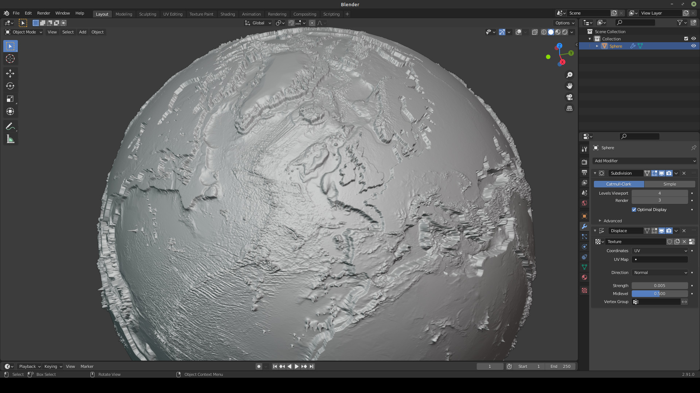
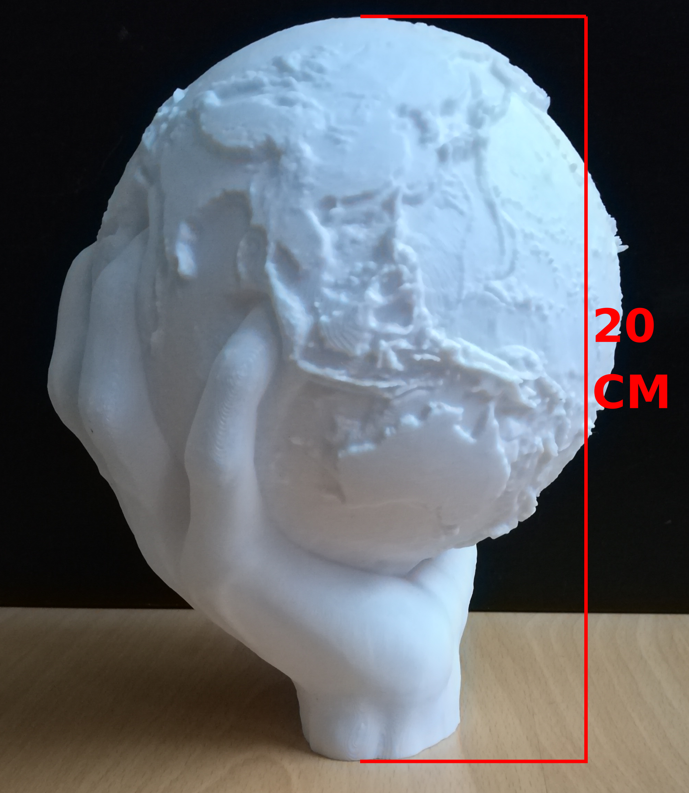

# earth-depthmap
8k depth/displacement map of Earth.
## About
This depthmap includes all elevation data from NASA's website like mountains and ocean beds with a custom alpha map to articulate Earth's land surfaces. 
The map is ideal for 3d printing because unlike a regular Earth depthmap, this map articulates countries that have almost the same geological depth as the tectonic plate they are on, for example England.

  

### This print uses the depthmap:

  

### How to download
The file is a 8k x 4k 32bit float .exr image so it's over 500mb and to big for github. 
https://drive.google.com/file/d/1_x82u9F9q2M-E_NdmbRUhlA55iRJrk5v/view?usp=sharing  

  Resource: 
  https://visibleearth.nasa.gov/collection/1484/blue-marble 
 

